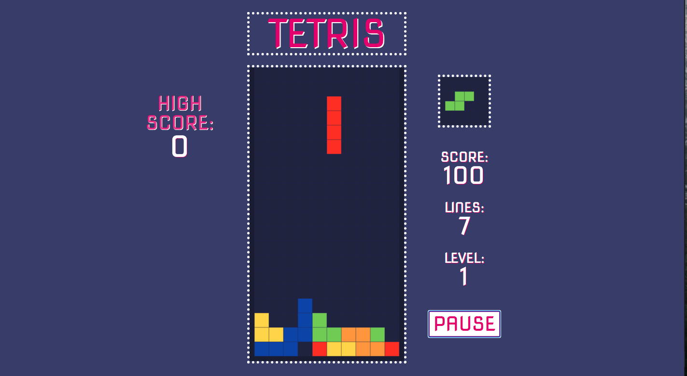

# Tetris

This was a personal project that i undertook to rebuild one of my favorite childhood GameBoy games. I built this once i was comfortable with a number of JavaScript aspects, doing this helped me practice what i had learnt and challenged me immensely.

# 

## Table of contents

1. [Demo](#demo)
2. [Technologies](#technologies)
3. [Features](#features)
4. [Development](#development)
5. [License](#license)

## Demo

Here is the working live demo:
[https://benjamin-gambling.github.io/tetris/](https://benjamin-gambling.github.io/tetris/).

## Technologies

- Vanilla JS, ES6+

## Features

- Retro Design
- Local High Score
- Audio
- DOM Manipulation
- Play/Pause Controls
- Different Levels

### Development

- Database high score
- Fix animation bugs

## License

> You can check out the full license [here](LICENSE)

This project is licensed under the terms of the **MIT** license.
